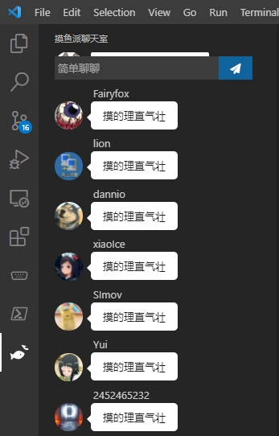

# 摸鱼派聊天室 VSCode 扩展

基于摸鱼打工人社区——[摸鱼派](https://fishpi.cn)开放 API 开发的聊天室扩展，可以在里面边写 Bug 边愉快地吹水摸鱼。 。

## 功能

- 💬 基本聊天吹水；
- 🧧 领取/发送积分红包；
- 😎 内置表情包(按下`:`加字母调出表情列表)和自定义表情包；
- 📷 上传发送图片；
- ☁️ 同步收藏表情包；
- 📦 消息菜单列表（`@`用户，回复消息，收藏表情，撤回消息）。

## 扩展设置

- `pwl-chat.viewType`: 设置聊天室显示模式，文字模式将隐藏一切图片与大多数样式。默认为`图文模式`。

## Release Notes

### 0.0.9
- 更新域名。

### 0.0.8
- 修正复读折叠撤回 Bug。
- 添加发送红包功能。

### 0.0.7
- 修正登录后没有重新获取表情包问题；
- 修正连发红包被折叠问题；
- 修正历史红包可能合并问题；
- 加入圣诞节彩蛋。

### 0.0.6
- 修正回复功能不可用问题；
- 加入复读合并功能；
- 加入设置选项 `View Type`，用于设置显示模式。

### 0.0.5
- 加入消息菜单，可以`@`用户，回复消息，收藏表情，撤回消息等；
- 加入表情包功能；

### 0.0.4
- 加入图片上传功能

### 0.0.3
- 紧急维护，修改活跃度更新频次，提升服务器稳定性。

### 0.0.2
- 加入积分红包领取功能。
- 加入`@`和内置表情提示。

### 0.0.1
- 完成初版。

## 前端调试说明
1. 按下 `Ctrl + Shift + P` 选择 `Task: Run Task`，运行 `vue serve` Task。
2. 按 `F5` 启动，调试前端代码使用 VSCode 的 Developer Tools (`Ctrl + Shift + I`)。
3. 在 Developer Tools 找到 `webviewview-pwl-chat-chatview` 中的 `active-frame` 中的 `localhost`，修改前端代码 (`views`目录) 会实时更新。
-----------------------------------------------------------------------------------------------------------
**Enjoy!**
